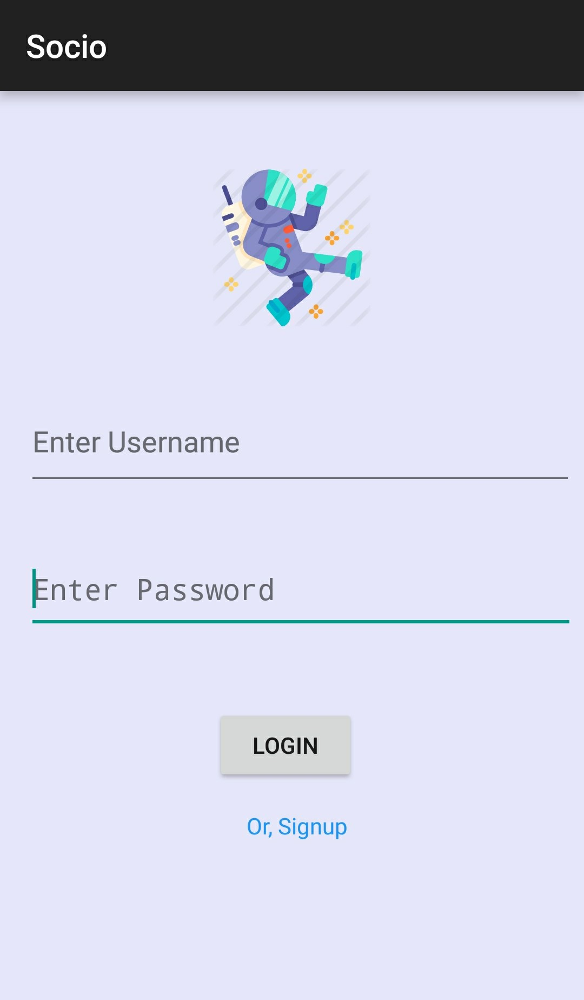
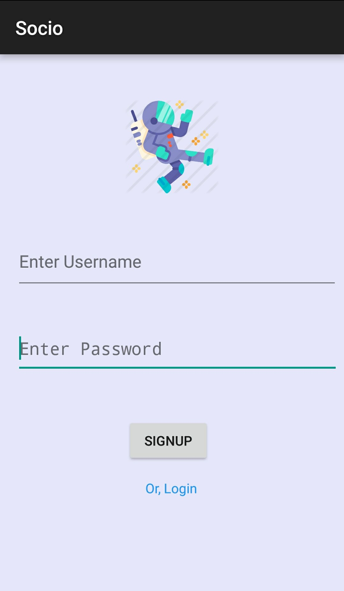
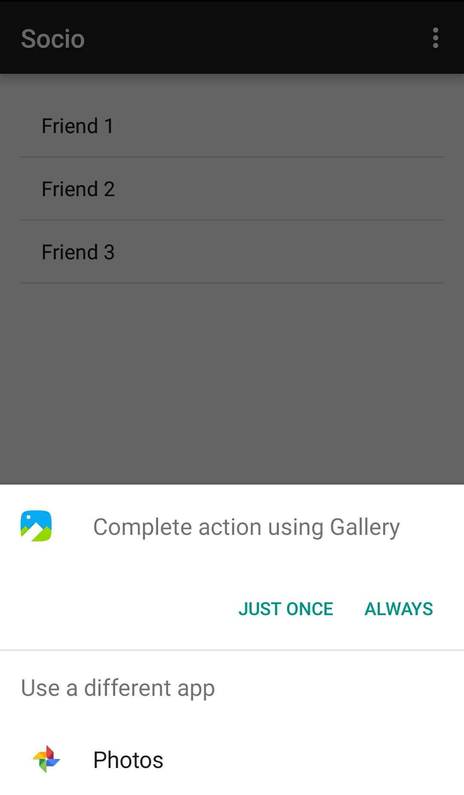

# Socio

## About

This is a social media app which is connected to parse server for storing data and authentication purposes which is being set 
up on AWS.

## Features

- Simple Signup and Login feature which stores data on the parse server.
- Option of sharing images from your gallery to your feed.
- Option of seeing your friend's feed and check the images they have shared.
- Make multiple friends and Chat directly with them. 
- Logout feature which takes you directly to the login page.

## Screenshots

   |  |  
 
   | 

